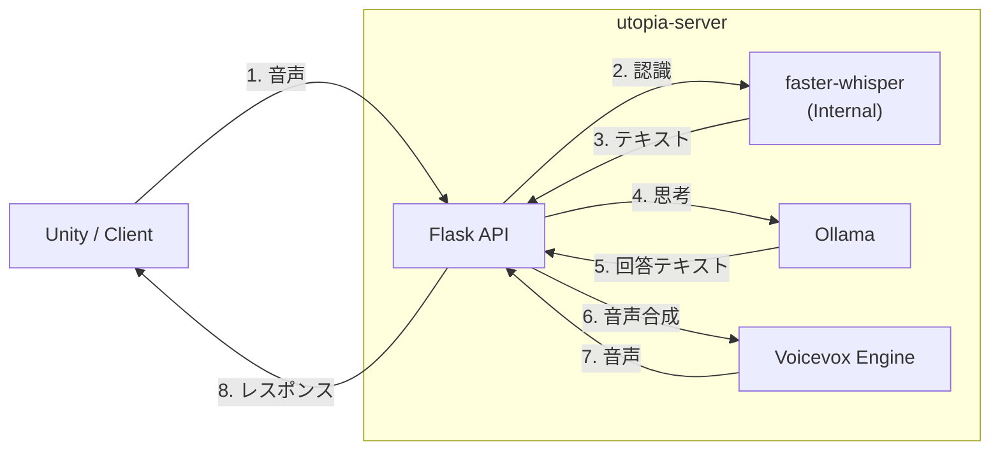

# utopIA-server-v1

Unity などのクライアントから利用するための **ローカル音声対話サーバ**です。
Docker Compose で faster-whisper (音声認識)、Ollama (LLM)、VOICEVOX (音声合成) の3 つのサービスをまとめて起動し、Flask アプリケーションがそれらを統合制御します。

## 🚀 機能概要（耳・脳・口）

現時点では、人間の感覚処理の順序（聞く → 考える → 話す）に対応した 3 つの API を提供しています。

1.  👂 **Ear (STT): `/api/stt`**
    * 音声データを受け取り、テキストに変換します。
    * **faster-whisper** (`large-v3`) を使用。VAD（発話区間検出）対応。
2.  🧠 **Brain (LLM): `/api/ask_text`**
    * テキストを受け取り、思考（回答）をテキストで返します。
    * **Ollama** (`llama3` 等) を使用。
3.  🗣️ **Mouth (TTS): `/api/ask_tts`**
    * テキスト（思考）を受け取り、それを喋った音声データを返します。
    * 内部で LLM に回答を生成させ、それを **VOICEVOX** で音声化して返却することも可能です。

## 🛠️ システム構成


## ⚡ クイックスタート

### 1. 起動
リポジトリをクローンします。
```bash
git clone https://github.com/Toy10ka/utopIA-server-v1.git
cd utopIA-server-v1
```

Docker Compose で起動します。
※ 初回ビルド時に STT 用の GPU ライブラリ (cuBLAS 12等) が自動インストールされます。

```bash
docker compose build
docker compose up -d
```

### 2. LLM モデルの準備
Ollama コンテナに使用したいモデル（例: `llama3:8b`）をダウンロードさせます。

```bash
docker compose exec ollama ollama pull llama3:8b
```

### 3. 動作確認
サーバー内のテストスクリプト、または `curl` を使って「耳→脳→口」の順に動作を確認します。

```bash
# 1. 耳のテスト (STT)
# 用意した音声ファイル(answer.wav)を送信してテキスト化
curl -X POST "http://localhost:5000/api/stt" \
     -H "Content-Type: audio/wav" \
     --data-binary "@src/answer.wav"

# 2. 脳のテスト (LLM)
# テキストを送ってテキストで返事をもらう
curl -X POST "http://localhost:5000/api/ask_text" \
     -H "Content-Type: application/json" \
     -d '{"prompt":"ラーメンの魅力を一言で"}'

# 3. 口のテスト (LLM + TTS)
# 質問を送って、回答を「音声ファイル」で受け取る
curl -X POST "http://localhost:5000/api/ask_tts" \
     -H "Content-Type: application/json" \
     -d '{"prompt":"自己紹介してください","speaker":1}' \
     -o reply.wav
```

## 📡 API リファレンス

### 1. 耳 (STT): 音声認識

音声データを送信し、文字起こし結果を取得します。

* **Endpoint**: `POST /api/stt`
* **Headers**: `Content-Type: audio/wav`
* **Body**: WAV ファイルのバイナリデータ
* **Response (JSON)**:
    ```json
    {
      "text": "こんにちは、音声認識のテストです。",
      "language": "ja",
      "duration_sec": 3.5,
      "segments": [ ...詳細なタイムスタンプ情報... ]
    }
    ```

### 2. 脳 (LLM): テキストチャット

音声合成を行わず、LLM とのテキストチャットのみを行います。

* **Endpoint**: `POST /api/ask_text`
* **Body**: `{"prompt": "こんにちは"}`
* **Response**: `{"text": "こんにちは！何かお手伝いしましょうか？"}`

### 3. 口 (LLM + TTS): 音声会話

テキスト（プロンプト）を送信し、LLM の回答を **WAV 音声ファイル** として取得します。

* **Endpoint**: `POST /api/ask_tts`
* **Headers**: `Content-Type: application/json`
* **Body**:
    ```json
    {
      "prompt": "おはようございます！",
      "speaker": 1
    }
    ```
    * `speaker`: VOICEVOX の話者 ID 
* **Response**: `audio/wav` (バイナリデータ)
  
## ⚙️ 設定 (環境変数)

`docker-compose.yml` の 'utopia-server' サービスで以下の設定を変更可能です。

| 変数名 | デフォルト値 | 説明 |
| :--- | :--- | :--- |
| `STT_MODEL_NAME` | `large-v3` | Whisper のモデルサイズ (`medium`, `large-v3` 等) |
| `STT_DEVICE` | `cuda` | `cuda` (GPU) または `cpu` |
| `STT_COMPUTE_TYPE` | `float16` | 計算精度。VRAM 節約時は `int8_float16` 推奨 |
| `STT_PRELOAD` | `1` | `1` にするとサーバー起動時にモデルをロードし、初回の待ち時間を短縮 (推奨) |
| `OLLAMA_BASE_URL` | `http://ollama:11434` | LLM サーバーのアドレス |
| `VOICEVOX_BASE_URL` | `http://voicevox-engine:50021` | TTS サーバーのアドレス |

```yaml
services:
  utopia-server:
    environment:
      - NVIDIA_VISIBLE_DEVICES=all

      # LLM / TTS サーバの URL
      - OLLAMA_BASE_URL=http://ollama:11434
      - VOICEVOX_BASE_URL=http://voicevox-engine:50021

      # STT (faster-whisper) 設定
      - STT_MODEL_NAME=large-v3        # 使用モデル
      - STT_COMPUTE_TYPE=float16       # float16 / int8_float16 など
      - STT_DEVICE=cuda                # cuda / cpu
 ```


## 📂 ディレクトリ構成

```
.
├─ Dockerfile            # utopia-server ビルド定義
├─ docker-compose.yml    # 構成定義
├─ .devcontainer/        # VS Code Dev Container 設定
│   └─ devcontainer.json
├── src/
│   ├── server.py        # メインサーバー (Flask)
│   ├── *.sh             # 動作確認用シェルスクリプト
│   └── audio.wav        # テスト用音声ファイル
├── models/              # モデルキャッシュ (Volume)
├─ requirements.txt      # utopia-server 用 Python 依存
└─ README.md
```

## ライセンス
MIT License

